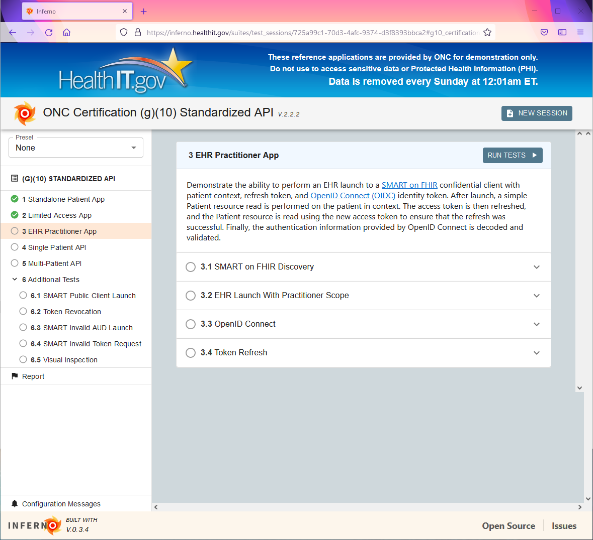
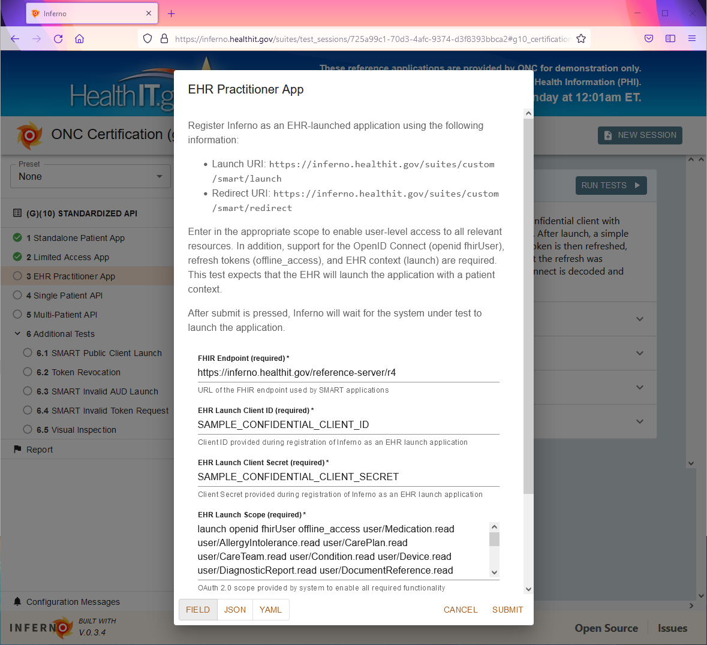
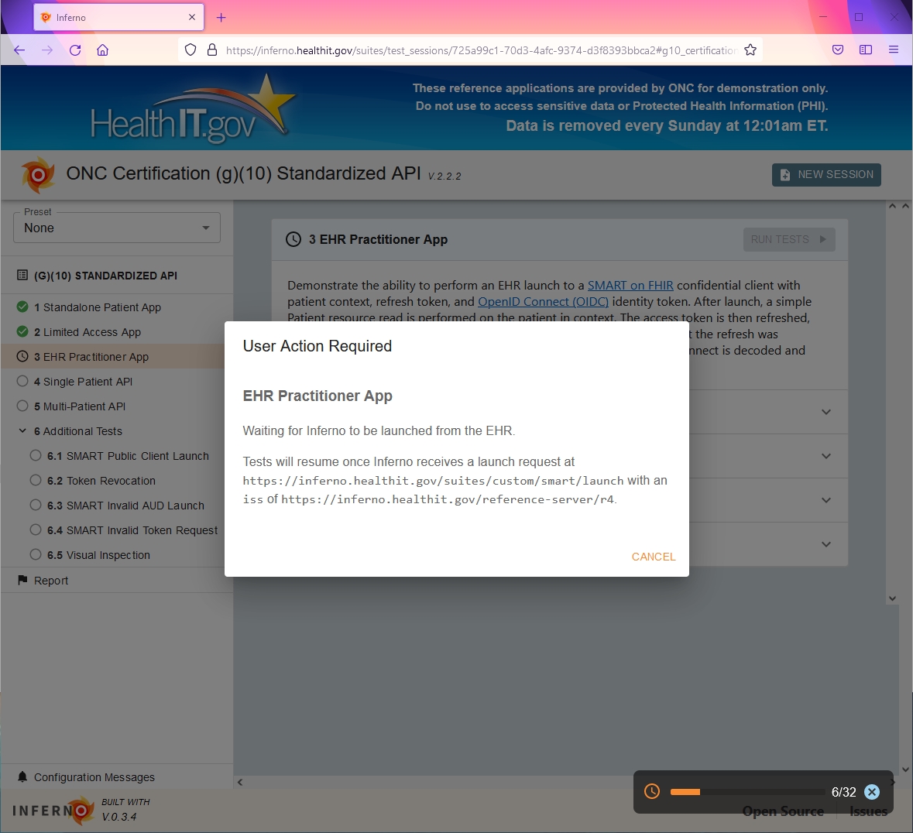
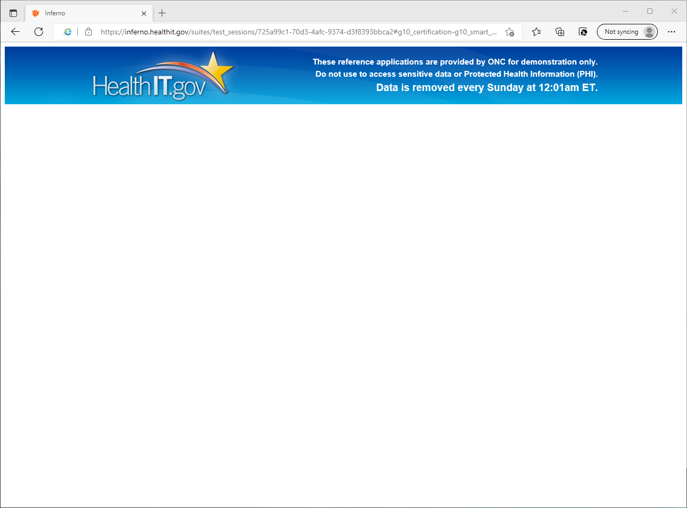
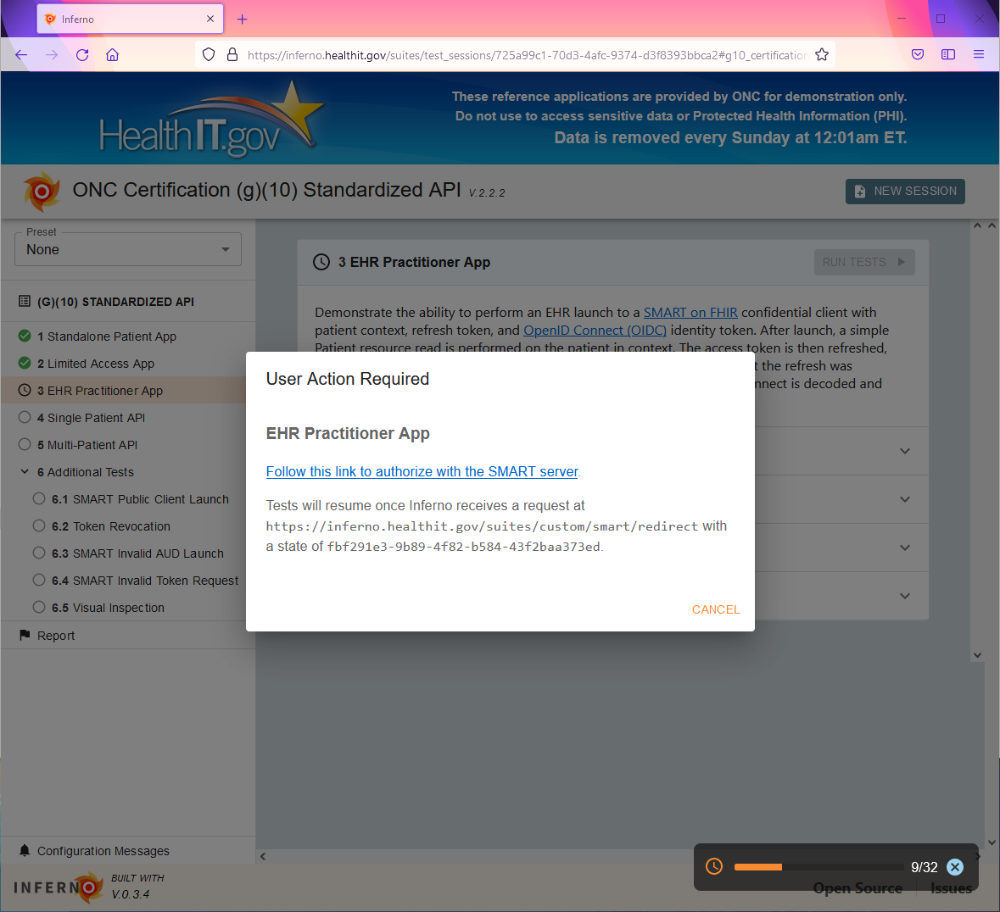

The Inferno (g)(10) Standardized API test kit provides a web user interface that
currently does not support the use of Internet Explorer. _Microsoft Edge_,
_Firefox_, _Safari_, or _Chrome_ are recommended for use by the tester who is
executing the Inferno tests.

Inferno tests the **EHR Practitioner App** launch functionality by instructing
the system under test to launch the Inferno application from within the EHR
interface. In cases where the system under test uses Internet Explorer as an
embedded browser to launch these applications, Inferno will not render properly.
Since the ONC (g)(10) Standardized API Certification Criterion does not specify
constraints on browsers used within the EHR to launch 3rd party applications,
the following steps may be taken to test these systems.

Screenshots are provided against v2.2.2 of this Test Kit, and therefore the specific
test IDs and descriptions are subject to change. However, the same general
steps apply.

# Step 1

On a system separate from the EHR being tested, launch Inferno from within
Microsoft Edge, Firefox, Safari, or Chrome browser.

Start the **EHR Practitioner App** test.

Inferno will pause, indicating that it is waiting for the EHR to initiate a launch to Inferno.

# Step 2

Outside of the browser that is running the Inferno tests, open the EHR and navigate to where the Inferno application will be launched. The Inferno reference server site provides a simple interface to launch Inferno -- the EHR will have a different interface than this. Note that IE11 mode is enabled to demonstrate what this will look like for EHRs using Internet Explorer as an embedded browser to launch applications.

Launch the Inferno application. You will be presented with a mostly blank screen.

# Step 3

Returning to the original browser that began the tests, the tests will now
proceed to the next step, indicating that Inferno will redirect the browser back
to the system under test.

At this point, the tester may simply click on that link within Inferno, which
will complete the authorization handshake and, if functioning properly, will issue
Inferno a bearer token that it will use to download resources.

The system under test may alternatively copy this link and open it from within
the embedded browser within the EHR under test, and then return to the original
test browser to observe the tests running. Either way, the purpose of the test
is demonstrated: that the system under test is capable of launching a third
party application.
