# Inferno (g)(10) Standardized API Test Kit Walkthrough

This walkthrough introduces the **Inferno (g)(10) Standardized API Test Kit** by
demonstrating its use as an automated testing tool for the [§170.315(g)(10)
Standardized API for patient and population services
criterion](https://www.healthit.gov/test-method/standardized-api-patient-and-population-services)
of the [21st Century Cures Act: Interoperability, Information Blocking, and the
ONC Health IT Certification
Program](https://www.govinfo.gov/content/pkg/FR-2019-03-04/pdf/2019-02224.pdf).
It uses the [ONC-hosted
instance](https://inferno.healthit.gov/suites/g10_certification) of the (g)(10)
Standardized API Test Kit to test against a [publicly available reference
server](https://inferno.healthit.gov/reference-server) that mimics a (g)(10)
conformant API.

At the end of this walkthrough, you will be able to use the **Inferno ONC
Certification (g)(10) Standardized API Test Kit** to evaluate APIs for
conformance to the ONC (g)(10) certification criteria. If you are interested in
how to use the Inferno Framework to test other FHIR-based data exchanges that
fall outside the scope of ONC (g)(10) certification criteria, please visit the
[Inferno Framework](https://inferno-framework.github.io) for more information.

* [Step 1: Create a new (g)(10) Test Session](#step-1-create-a-new-inferno-g10-test-session-and-select-standard-versions)
* [Step 2: Preset Inferno Reference Server (optional)](#step-2-preset-inferno-reference-server-optional)
* [Step 3: Perform Standalone Patient App
  Tests](#step-3-perform-standalone-patient-app-tests)
* [Step 4: Perform Limited
  Access App Tests](#step-4-perform-limited-access-app-tests)
* [Step 5: Perform
  EHR Practitioner App Tests](#step-5-perform-ehr-practitioner-app-tests)
* [Step 6: Perform Single Patient API
  Tests](#step-6-perform-single-patient-api-tests)
* [Step 7: Perform Multi-Patient API
  Tests](#step-7-perform-multi-patient-api-tests)
* [Step 8: Perform Additional Tests](#step-8-perform-additional-tests)
* [Step 9: Review Results](#step-9-review-results)

## Step 1: Create a new Inferno (g)(10) test session and select standard versions

* Go to <https://inferno.healthit.gov>.
* Select 'ONC (g)(10) Standardized Test Kit' under 'ONC Health Certification
  Program', which is an instance of Inferno configured to specifically test
  the requirements of the criteria in the ONC Health IT Certification Program.

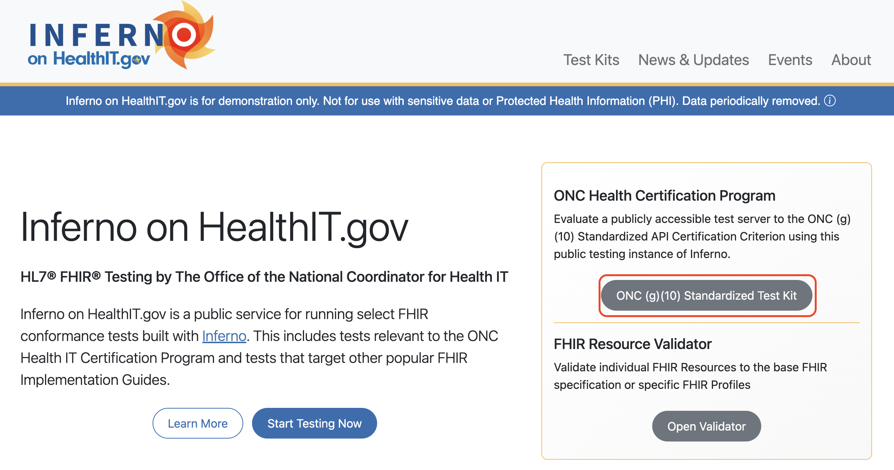

* Select which versions of Standards Version Advancement Process (SVAP) approved
  standards you would like to test against.  The Inferno (g)(10) tests will only
  test a system against a single set of SVAP approved standards in a single session.

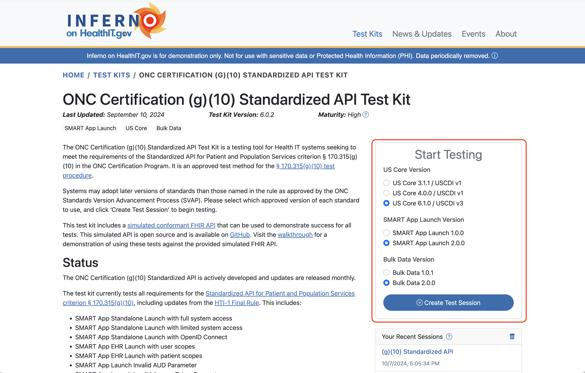

This will create a new test session.  The URL of this test session is not public
and is an unguessable unique URL, but may be shared.  Please note there is a
data retention policy as described in the banner of <https://inferno.healthit.gov>
and the session will eventually be purged.

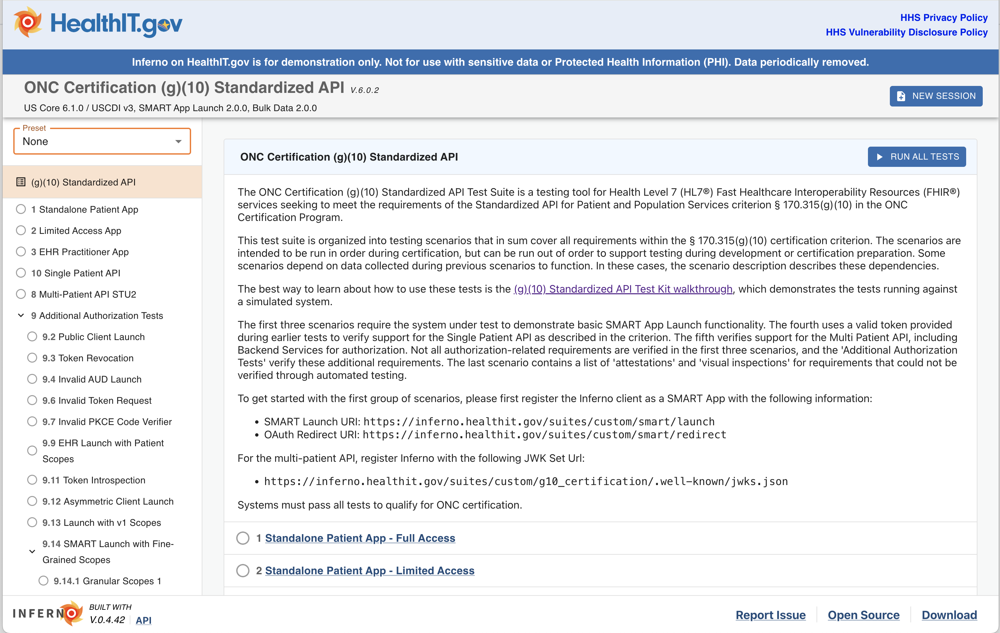

The header states which version of the (g)(10) test kit is currently being used
(`v6.0.2` in this case), as well as the options that are selected (`US Core
6.1.0 / USCDI v3, SMART App Launch 2.0.0, Bulk Data 2.0.0` in this case).

## Step 2: Preset Inferno Reference Server (optional)

The Inferno (g)(10) test kit provides an example API that is capable of passing
all Inferno (g)(10) tests, though by design it is not a fully-featured
implementation.  To test against this server, select the 'Inferno Reference
Server' under the 'Preset' dropdown.  This will pre-fill all required inputs
with the proper information to run tests against this server.  You may view this
server's general configuration information at
<https://inferno.healthit.gov/reference-server>, which hosts a FHIR endpoint at
<https://inferno.healthit.gov/reference-server/r4>.

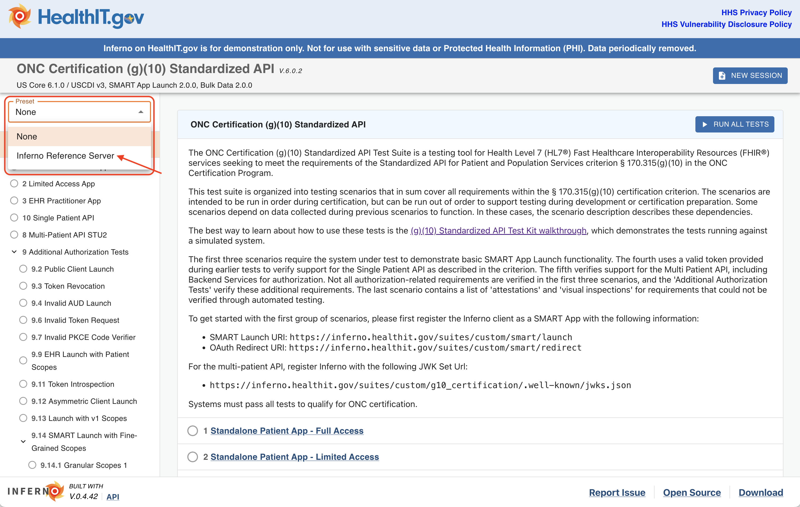

The Inferno (g)(10) Tests can be run all at once, though this walkthrough will
run them one at a time to provide information about each step.  To view the
first step, click 'Standalone Patient App - Full Access' in the center details
pane, or click 'Standalone Patient App' in the menu on the left.

## Step 3: Perform Standalone Patient App Tests

Inferno's tests for the ONC certification criteria are organized into seven steps.
This allows the tester to walk through the requirements in an order similar to
what would be done in a real-world situation, while limiting redundant testing.

The first step, 'Standalone Patient App', demonstrates the ability of a system
to perform a Patient Standalone Launch to a SMART on FHIR confidential client
with a patient context, refresh token, and OpenID Connect (OIDC) identity token.
After launch, a simple Patient resource read is performed on the patient in
context. The access token is then refreshed, and the Patient resource is read
using the new access token to ensure that the refresh was successful. The
authentication information provided by OpenID Connect is decoded and validated,
and simple queries are performed to ensure that access is granted to all USCDI
data elements.

* Click 'RUN TESTS'. You will be presented with a modal that provides necessary
  registration information for Inferno. If you opted to test Inferno against the
  Inferno Reference Server, these modal fields will be filled out with the
  Inferno reference server information.

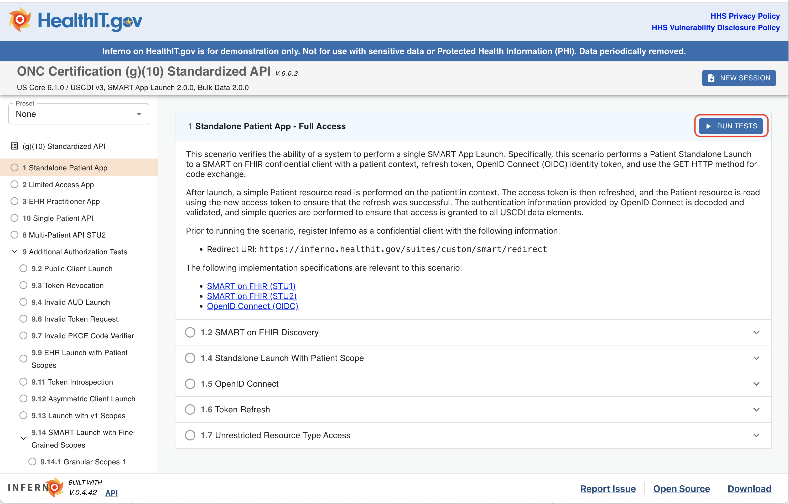

* Register Inferno as a standalone application for your FHIR server.
* In the Inferno modal, provide both the Standalone Client ID and Standalone
  Client Secret, and click 'SUBMIT'.

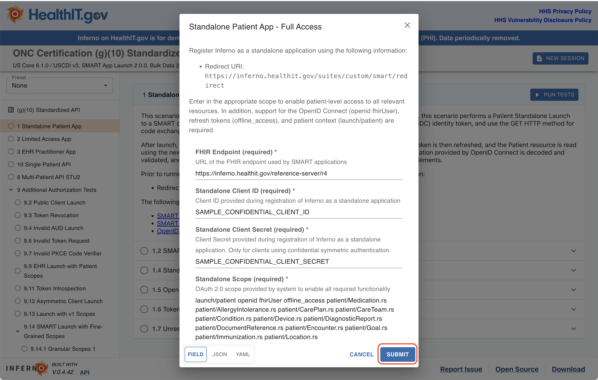

* The tests start executing until user input is required. A 'User Action
  Required' modal will appear to ask if Inferno can redirect to the FHIR
  server's authorization page. Click 'Follow this link to authorize with the
  SMART server'.

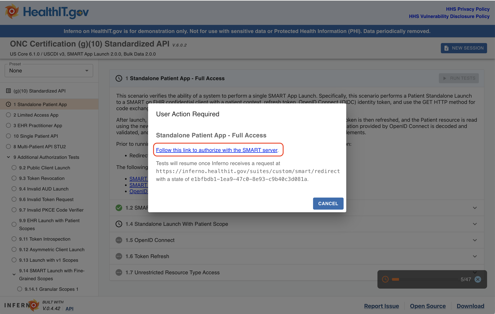

* From here you should follow the FHIR server's authorization process.  

* For the Inferno reference server:
  * Select a Patient. For this example, select patient 85.

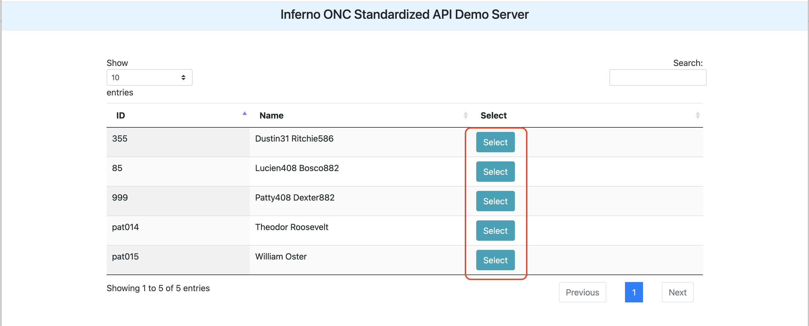

* Keep all scopes checked, and click 'Authorize'.

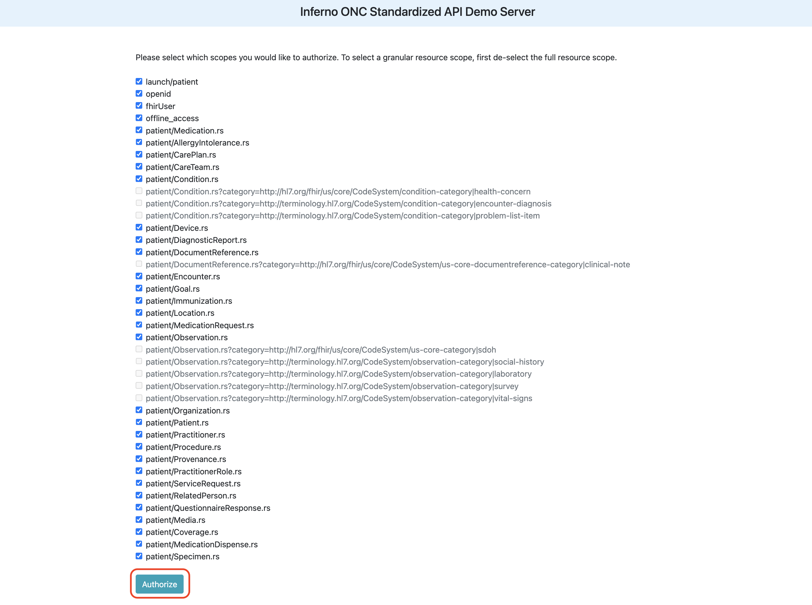

The authorization process should redirect you back to Inferno, which will
continue executing the tests.

You should be able to view the results of the 'Standalone Patient App' tests here.

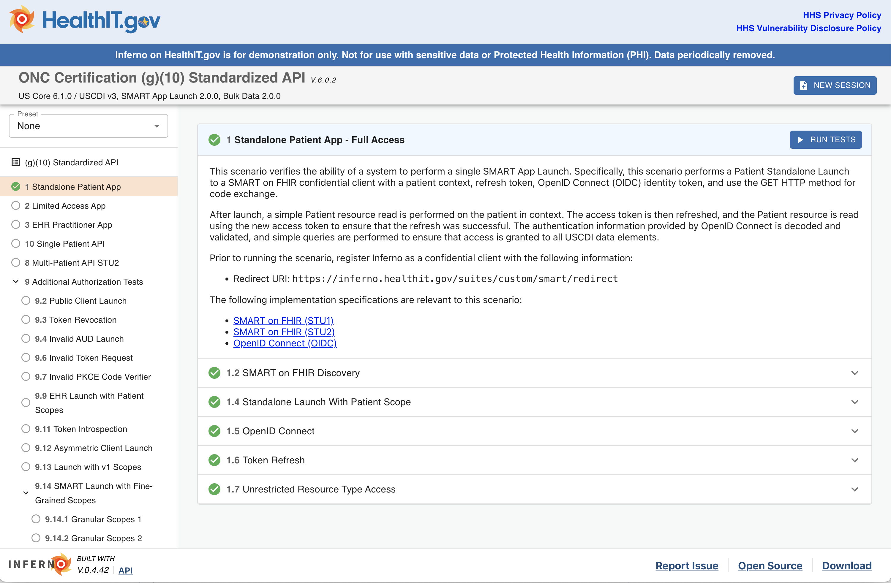

* Inferno provides in-depth information about what occurred during the course of
  the tests to help debug any possible errors. This includes pass/fail status on
  any given test, a list of errors, HTTP requests made during the course of the
  test, and a detailed test description.
* Click the arrow highlighted below next to 'SMART on FHIR Discovery', then the
  arrow next to 'About SMART on FHIR Discovery' to view information about this
  test suite. You can also click the arrows next to specific tests within a
  suite (e.g. test 1.2.01 below), then on 'ABOUT' to learn about that specific
  test.

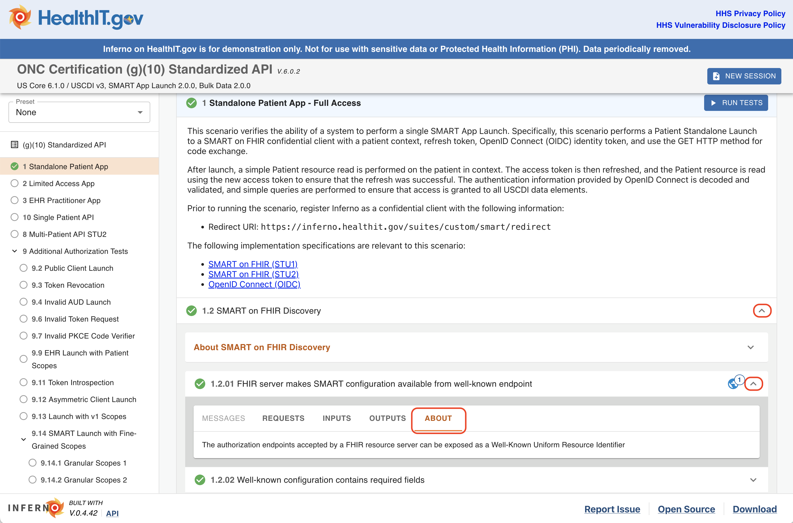

* You have now completed your first test.

## Step 4: Perform Limited Access App Tests

After you have finished reviewing the results from the 'Standalone Patient App'
tests, click on the 'Limited Access App' tab on the sidebar to progress to the
next step in the test procedure. This scenario demonstrates the ability to
perform a Patient Standalone Launch to a SMART on FHIR confidential client with
limited access granted to the app based on user input. The tester is expected to
grant the application access to a subset of desired resource types.

* Click on the 'Run Tests' button to begin.

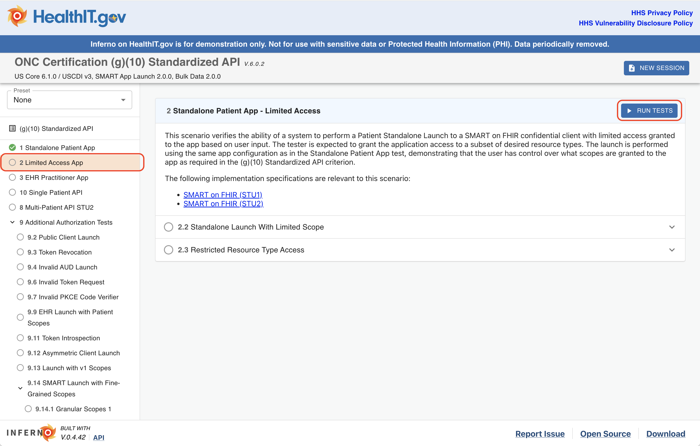

* Note the resources listed in the Expected Resource Grant for Limited Access Launch.

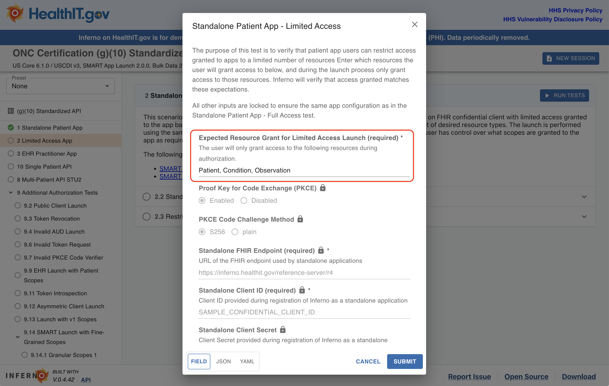

* Once you click 'SUBMIT', similar to the Standalone Patient App tests, Inferno
  will notify you that it is redirecting you to the Authorization server as
  part of the SMART on FHIR / OAuth launch sequence. Click 'Follow this link to
  authorize with the SMART server' to redirect to the FHIR server's
  authorization process.

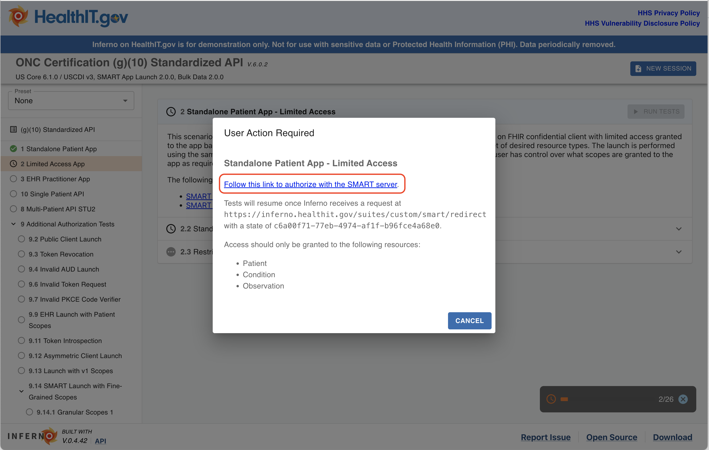

* From here you should follow the FHIR server's authorization process.  

For the Inferno reference server:

* Select a Patient. For this example, select patient 85.

* Deselect all FHIR resource-related scopes except for `patient/Condition.rs`,
  `patient/Observation.rs`, and `patient/Patient.rs` (the resources listed
  in the Expected Resource Grant for Limited Access Launch in the previous
  step), and click 'Authorize'.

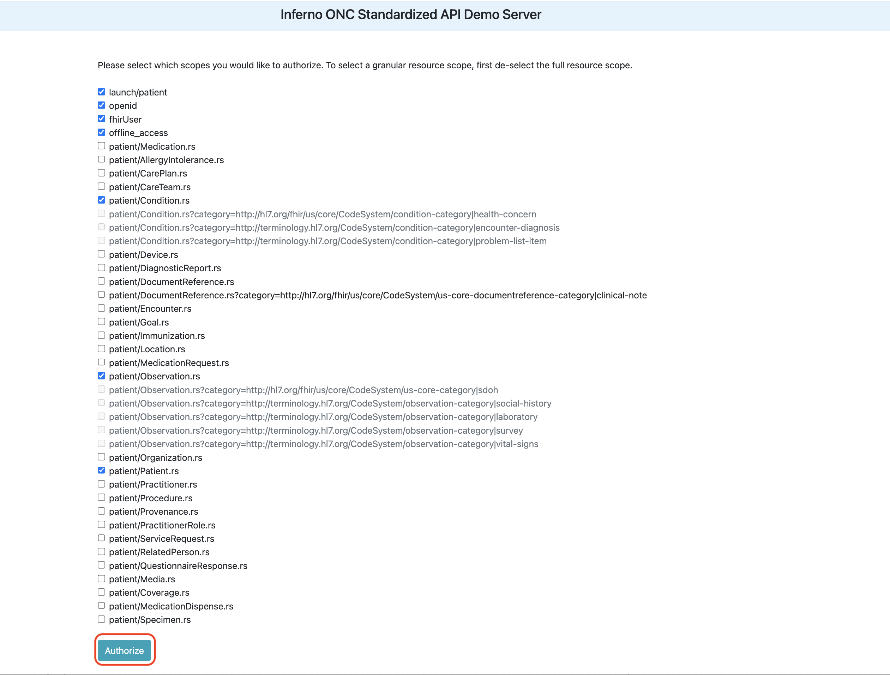

The authorization process should redirect you back to Inferno, which will
continue executing the tests.

## Step 5: Perform EHR Practitioner App Tests

Continue on to the 'EHR Practitioner App' set of tests. This set of tests
requires the user to initiate an app launch outside of Inferno in order to fully
demonstrate the ability of the server to support the EHR Launch flow as
described in the SMART App Launch Guide. Inferno tests this by pausing this set
of tests mid-execution, and waits at the specified launch point for the user to
initiate the launch sequence from the EHR. This action will then inform Inferno
that the test may continue running, with information provided during the launch.

* Click 'RUN TESTS'.

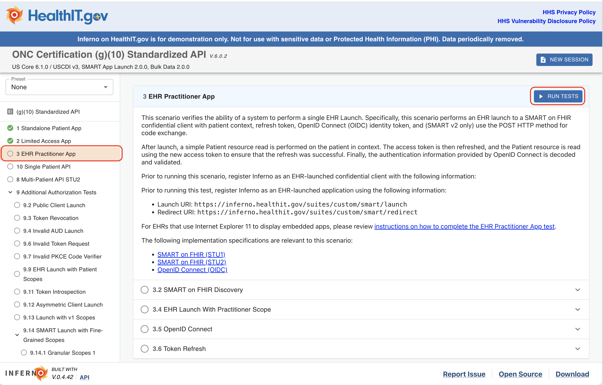

* The EHR Practitioner App modal should appear. Provide EHR Launch Client ID and
  EHR Launch Client Secret (prefilled if testing against the Inferno Reference
  Server). Inferno should must be registered with the system under test with the
  Launch and Redirect URIs listed in the input instructions.
* Click 'SUBMIT' to begin the tests.

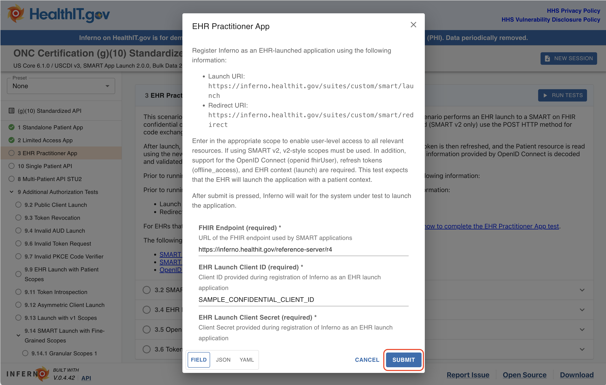

* The tests will begin executing and immediately the interface will notify the
  user that Inferno needs to receive an external action in order to continue. In
  this case, Inferno is waiting for the user to initiate an app launch from the
  EHR.

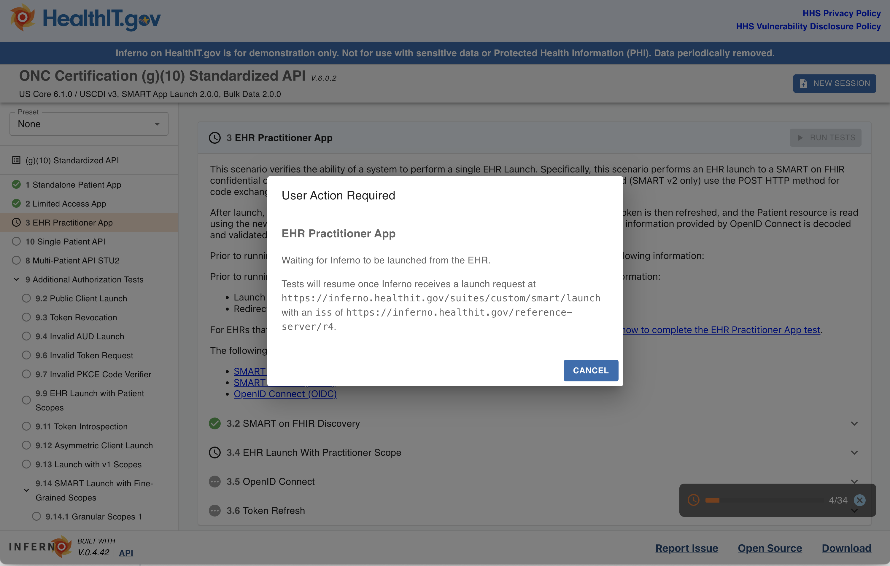

* Launch the app from your EHR from the provided app.  

For the Inferno reference server:

* Go to <https://inferno.healthit.gov/reference-server/app/app-launch>.  This is
  a very basic interface that will mimic an EHR user launching an external app,
  and providing patient and encounter contexts.  
* Enter in the provided launch URI, <https://inferno.healthit.gov/suites/custom/smart/launch>.
* Click 'Launch App'.

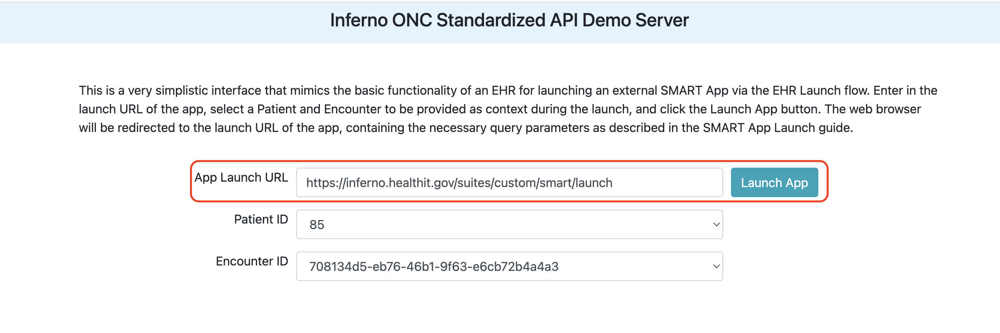

* From this point on, the tests will execute in a similar manner to the
  'Standalone Launch' sequence provided earlier.
* And finally, results will be displayed in a similar manner to the previous
  test groups.

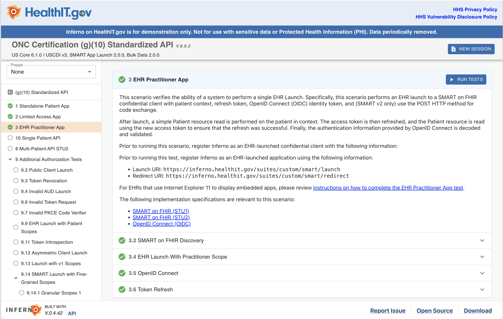

## Step 6: Perform Single Patient API Tests

At this point, the user should have received a Patient ID and be authorized to
perform the required FHIR queries on the FHIR server. Click on the 'Single
Patient API' tab to begin testing that capability.

Prior to this test being run, a validated access token must be used, which is
retrieved from the most recent Standalone Patient App Launch or EHR Practitioner
App Launch test run.

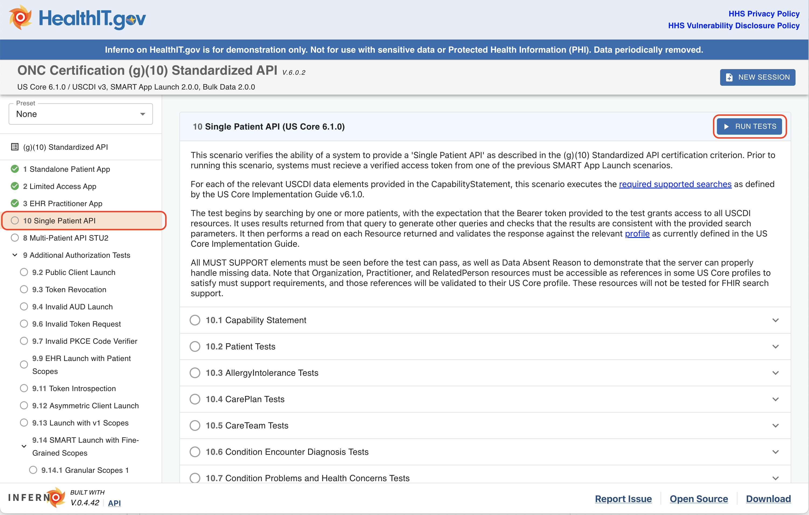

* Click 'RUN TESTS'.
* The user will be shown the Access Token collected earlier, as well as the
  Patient ID returned *on the most recent SMART Launch*. This may have been
  either the Standalone Launch or Patient launch -- this set of tests currently
  does not require users to demonstrate all of these queries in both situations.

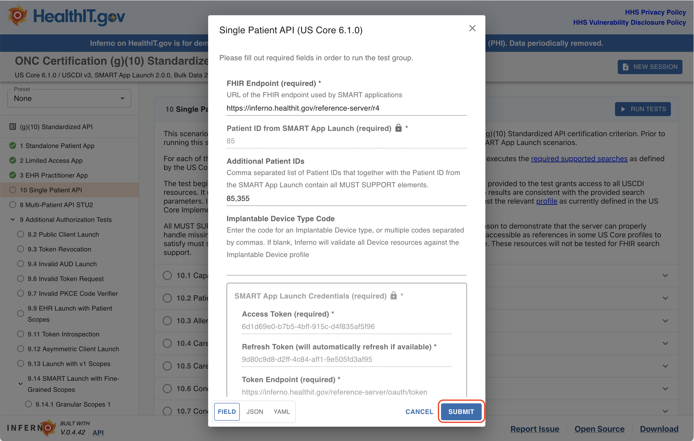

* These set of tests expect one more more complete patient records that include
  at least one example of every element labelled 'MUST SUPPORT' in relevant
  US Core profiles.  If a single test patient does not include all of this information,
  testers may enter Additional Patient IDs, beyond those provided as context
  in a previous launch.  The authorization token must grant access to these
  additional resources.
* Click 'SUBMIT'.
* After running these tests, you will be presented with the test results. These
  tests typically follow this pattern:
  * Ensure that the user does not have access to searching without the
    appropriate authorization header.
  * Perform a FHIR search for all resources of a certain type that are
    associated with the relevant patient.
  * For each of the filtered searches required by US Core / Argonaut, generate
    search queries that should return at least one result based on data that has
    already been seen, and verify that all data returned falls within the search
    criteria.
  * Validate all resources returned against the relevant profile.  This includes
    validating that codes are within required ValueSets.
  * Ensure that all references contained within the resource can be retrieved.
* Note: if the selected patient does not include all required resources, then
  some tests will be marked as 'SKIP'. The tester can then execute one of the
  Launch Sequence tests and authorize another patient, and only execute the
  tests that were previously skipped. This allows the test system to have the
  flexibility to demonstrate that all data can be returned, without requiring a
  single patient to have all required data elements.

## Step 7: Perform Multi-Patient API Tests

The Multi-Patient Authorization and API tests demonstrate the ability to export
clinical data for multiple patients in a group using FHIR Bulk Data Access IG.
This test uses Backend Services Authorization to obtain an access token from the
server. After authorization, a group level bulk data export request is
initialized. This test reads exported NDJSON files from the server and
validates the resources in each file. Finally, the test verifies that the 
server supports the `_outputFormat` and `_since` query parameters. To run the
test successfully, the selected group export is required to have every type
of resource mapped to USCDI data elements. Additionally, it is expected the
server will provide Encounter, Location, Organization, and Practitioner resources
as they are referenced as 'must support' elements in required resources.

* Click 'RUN TESTS'. The Multi-Patient Authorization and API Modal will appear.

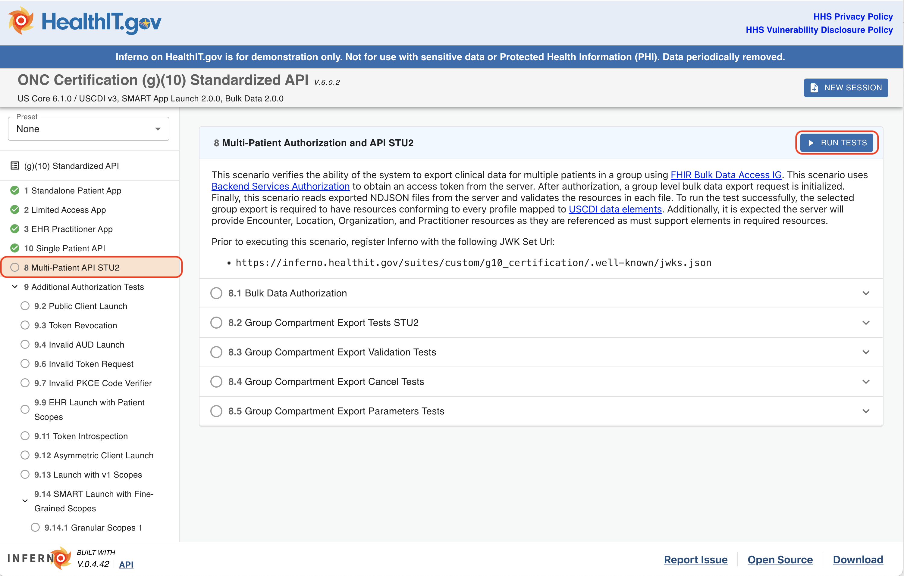

* Fill Bulk Data FHIR URL, Backend Services Token Endpoint, Bulk Data Client ID,
  Bulk Data Scopes, and Group ID.  Note that the FHIR endpoint may be different
  than the one provided to the Single Patient API tests.
* Click 'SUBMIT'.

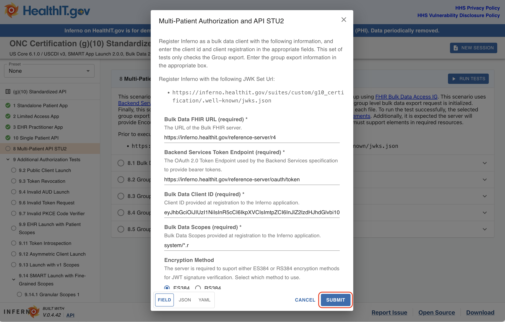

## Step 8: Perform Additional Tests

Not all requirements that need to be tested fit within the previous scenarios.
The tests contained in this section address remaining testing requirements. Each
of these tests needs to be run independently. Please read the instructions for
each in the ‘About’ section, as they may require special setup on the part of
the tester.

In this test, each section is run separately.

* **SMART Public Client Launch**. Register Inferno as a
  public client with patient access and execute standalone launch.
  * Click 'RUN TESTS'.
  * Fill out the Public Client Standalone Launch with OpenID Connect Modal.
  * Click 'SUBMIT'.
  * Follow the Redirect Authorization process similar to the Standalone Patient
    App Tests.

* **Token Revocation**. This test demonstrates the Health IT module is capable
  of revoking access granted to an application. This test relies on the user to
  verify that the token was revoked.
  * Click on 'RUN TESTS'.
  * Revoke a Token through the EHR. For the Inferno Reference Server:
    * Fill out the Token Revocation modal with the correct FHIR Endpoint, OAuth
      2.0 Token Endpoint, and the Revoked Bearer Token and Corresponding Refresh
      Token. Change the 'Prior to executing test, Health IT developer demonstrated
      revoking tokens provided during patient standalone launch' field to 'Yes',
      and copy the Revoked Bearer Token highlighted below.

      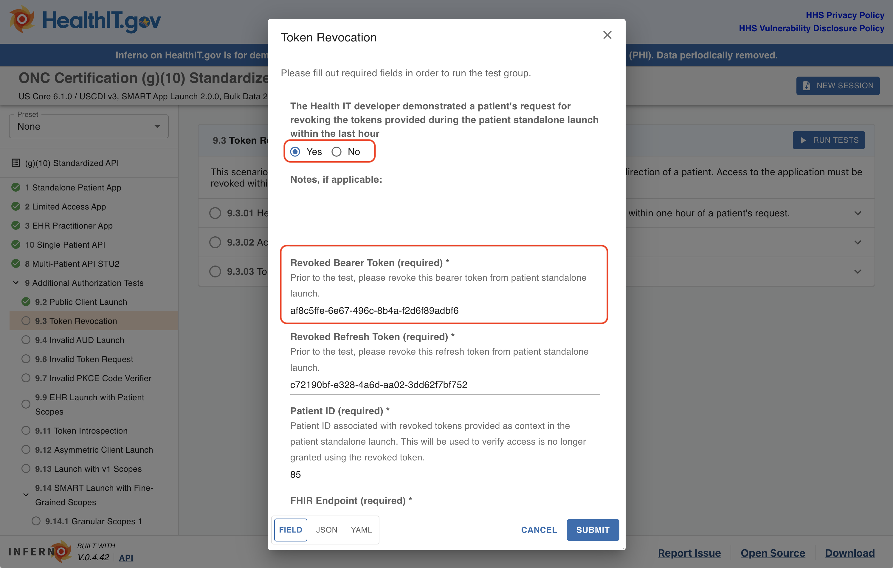

    * Go to <https://inferno.healthit.gov/reference-server/oauth/token/revoke-token>
      in another tab and insert the copied Token value from the modal into the text
      input and click 'Revoke'. This will also revoke the corresponding refresh
      token.

      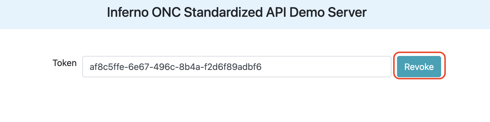

    * Return to the Token Revocation modal and click 'SUBMIT'.

* **Invalid AUD Launch**. The purpose of this test is to demonstrate that
  the server properly validates the AUD parameter.
  * Click 'RUN TESTS'.
  * Fill out the SMART App Launch Error: Invalid AUD Parameter modal.

    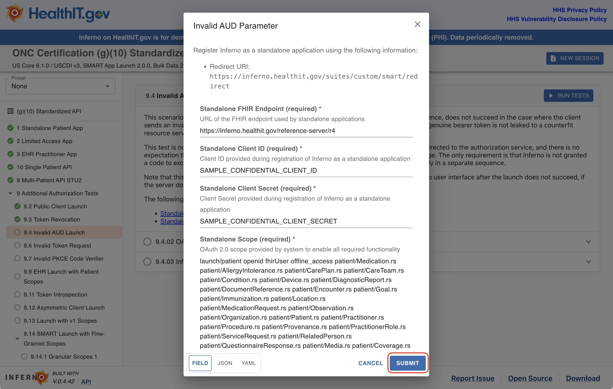

  * Click 'SUBMIT'. The Test Running modal will appear.

    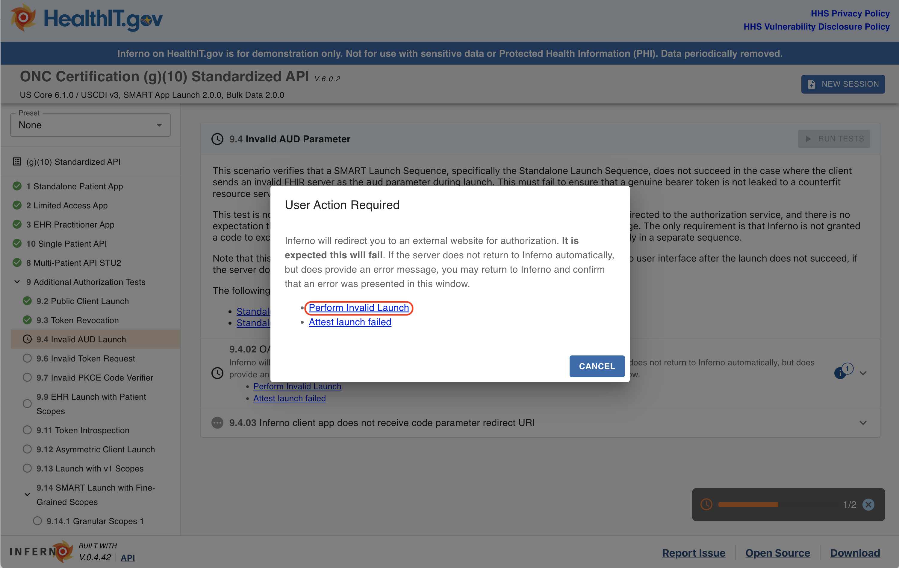

  * Right click 'Perform Invalid Launch' and select 'Open link in new tab', which
    will redirect you to the FHIR server's authorization process. The purpose of
    this test is to confirm that the FHIR server does NOT return back to Inferno,
    but instead displays an error message indicating that the AUD value is
    invalid.
  * For example, with the Inferno reference server:

    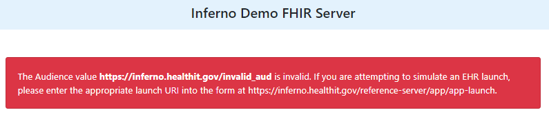

  * As soon as you have confirmed that the redirect displays an error, return to
    your Inferno tab and click 'Attest launch failed' to complete the test.

* **SMART App Launch Error: Invalid Access Token Request**. The purpose of this
  test is to demonstrate that the server properly validates access tokens.
  * Click 'RUN TESTS'.
  * Fill out the SMART App Launch Error: Invalid Access Token Request modal.

    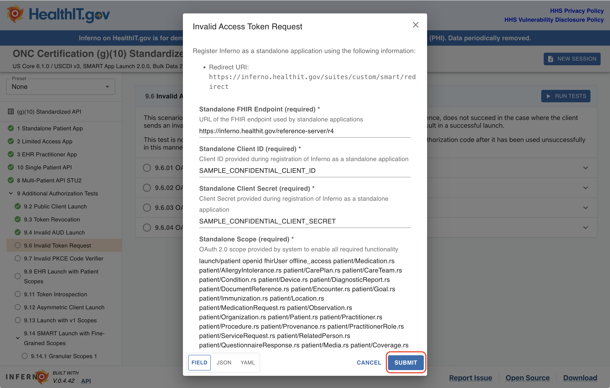

  * Click 'SUBMIT'.
  * Click 'Follow this link to authorize with the SMART server', and follow steps
    to authorize similar to the Standalone Patient App tests. After you click
    'Authorize' you will be redirected to the Inferno page, where the test will
    complete.

* **Invalid PKCE Code Verifier**. The purpose of this
  test is to verify that a SMART Launch Sequence, specifically the Standalone Launch Sequence,
  verifies that servers properly support PKCE.
  * Click 'RUN TESTS'.
  * Fill out the Invalid PKCE Code Verifier modal.

    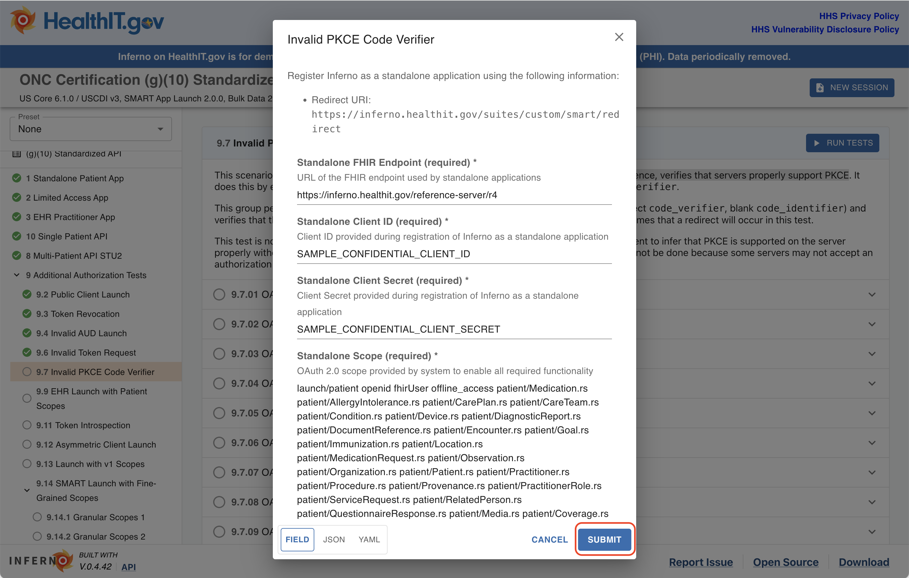

  * Click 'SUBMIT'.
  * There will be 4 'User Action Required' modals that will appear to ask if Inferno can redirect to the FHIR
    server's authorization page with different PKCE code_verifiers
    * For each one, click 'Follow this link to authorize with the SMART server', and follow steps
      to authorize similar to the Standalone Patient App tests. After you click
      'Authorize' you will be redirected to the Inferno page, where the test will
      pop up the next modal until all 4 have been completed, at which point the test will complete.

      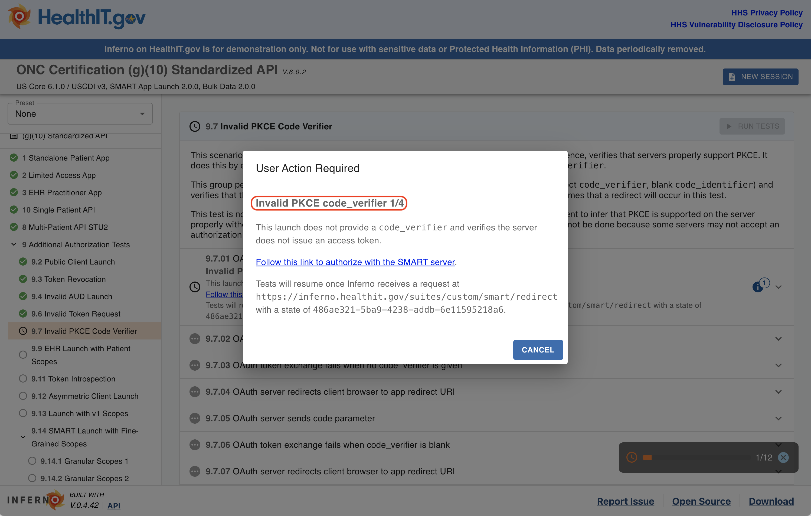
      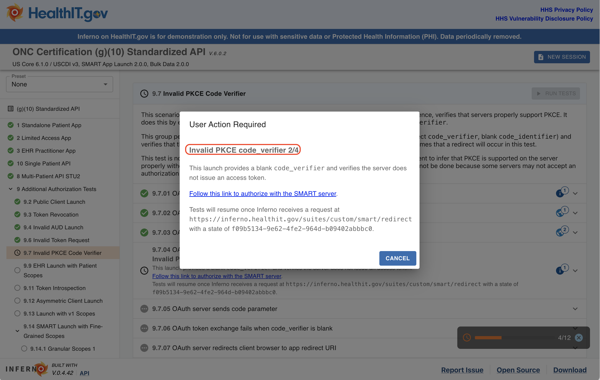
      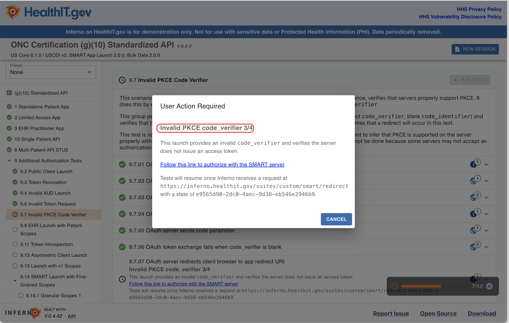
      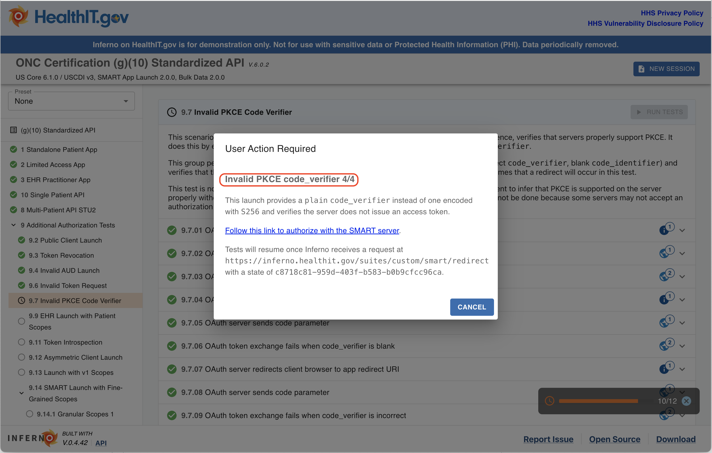

* **EHR Launch with Patient Scopes**. The purpose of this
  test is to demonstrate that the server can support EHR launches with patient
  scopes.  In the 'EHR Practitioner Launch' test, the system demonstrates that
  user-level scopes can be used.  However, systems must also demonstrate that they
  can provide patient-level scopes if the application being launched does not need
  access to more than one patient at a time to function.
  * Execute this test in the same way that the 'EHR Practitioner App' is executed,
    except provide patient-level scopes.

* **Token Introspection**. The purpose of this
  test is to verify the ability of an authorization server to perform token introspection
  in accordance with the SMART App Launch Implementation Guide Section on Token Introspection.
  * If the system's introspection endpoint is access controlled, testers must enter their own
    HTTP Authorization header for the introspection request.
  * Click 'RUN TESTS'.
  * Fill out the Token Introspection modal.
    * Note: If not using the Inferno Reference server, testers must
    enter their own HTTP Authorization header for the introspection request if the system's introspection
    endpoint is access controlled

    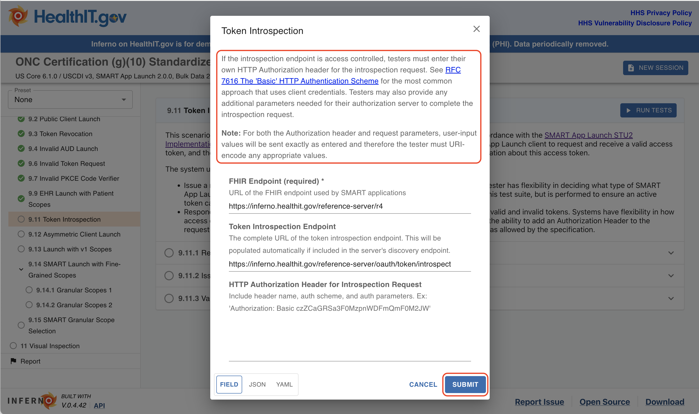

  * Click 'SUBMIT'.
  * Click 'Follow this link to authorize with the SMART server', and follow steps
    to authorize similar to the Standalone Patient App tests. After you click
    'Authorize' you will be redirected to the Inferno page, where the test will
    complete.

* **Asymmetric Client Launch**. The purpose of this
  test is to verify a system's support for confidential asymmetric client authentication.
  * If not using the Inferno Reference server, register Inferno as a standalone application
    using the Redirect URI and JWKS URI information contained at the top of the modal
  * Click 'RUN TESTS'.
  * Fill out the Asymmetric Client Standalone Launch modal.

    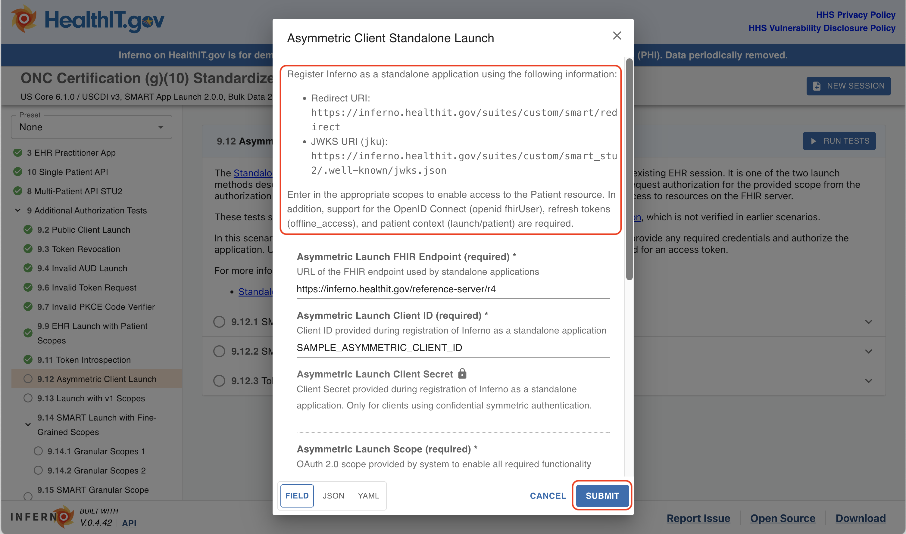

  * Click 'SUBMIT'.
  * Click 'Follow this link to authorize with the SMART server', and follow steps
    to authorize similar to the Standalone Patient App tests. After you click
    'Authorize' you will be redirected to the Inferno page, where the test will
    complete.

* **Launch with v1 Scopes**. The purpose of this
  test is to verify the ability of a system to support a Standalone Launch when v1
  scopes are requested by the client. It verifies that systems implement the permission-v1
  capability as required.
  * If not using the Inferno Reference server, register Inferno as a standalone application for
    your FHIR server using the redirect URI at the top of the SMART v1 scopes modal, and enter
    in the appropriate v1 scopes to enable patient-level access to all relevant resources.
  * Click 'RUN TESTS'.
  * Fill out the App Launch with SMART v1 scopes modal.

    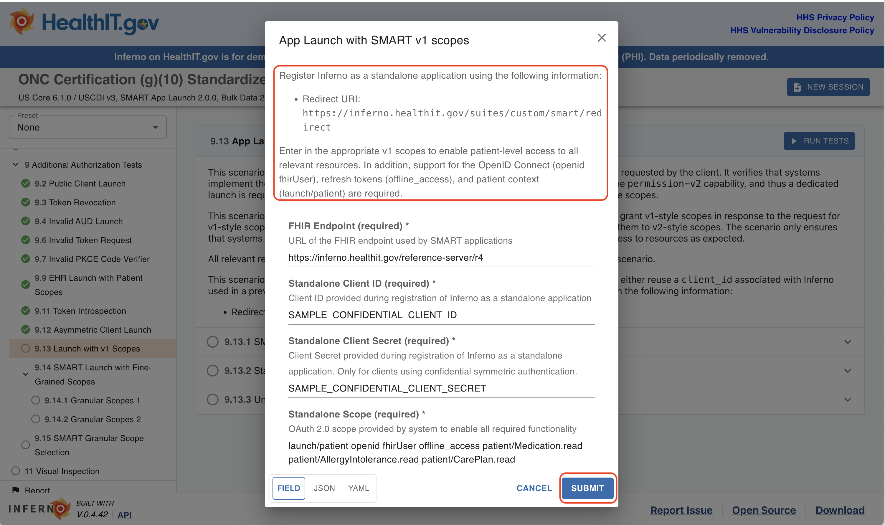

  * Click 'SUBMIT'.
  * Click 'Follow this link to authorize with the SMART server', and follow steps
    to authorize similar to the Standalone Patient App tests. After you click
    'Authorize' you will be redirected to the Inferno page, where the test will
    complete.

* **SMART Launch with Fine-Grained Scopes**. This test contains two groups of
finer-grained scope tests, each of which includes a SMART Standalone Launch that
requests a subset of finer-grained scopes, followed by FHIR API requests to verify
that scopes are appropriately granted.
  * **Granular Scopes 1**
    * Click 'RUN TESTS'.
    * Fill out the Granular Scopes 1 modal.

      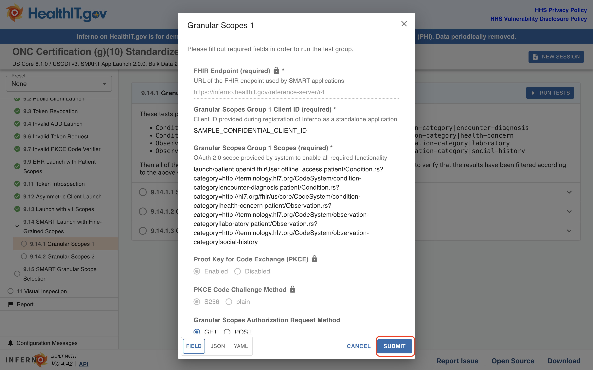

    * Click 'SUBMIT'.
    * Click 'Follow this link to authorize with the SMART server', and follow steps
      to authorize similar to the Standalone Patient App tests. After you click
      'Authorize' you will be redirected to the Inferno page, where the test will
      complete.
  * **Granular Scopes 2**
    * Click 'RUN TESTS'.
    * Fill out the Granular Scopes 2 modal.

      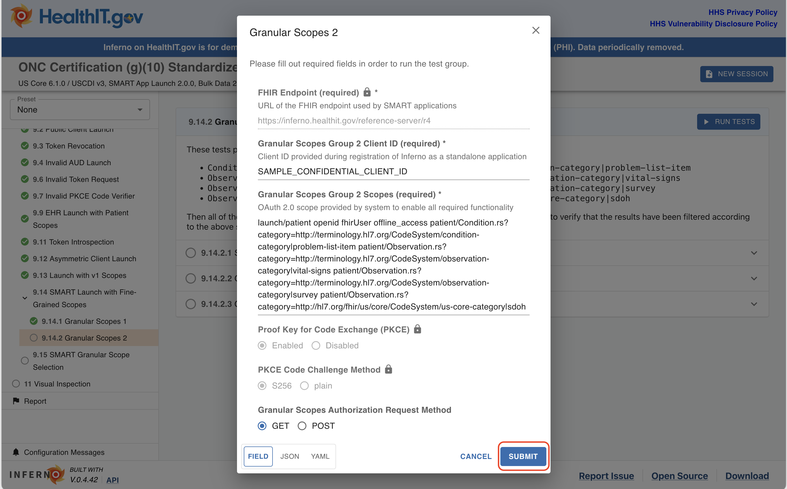

    * Click 'SUBMIT'.
    * Click 'Follow this link to authorize with the SMART server', and follow steps
      to authorize similar to the Standalone Patient App tests. After you click
      'Authorize' you will be redirected to the Inferno page, where the test will
      complete.

* **SMART Granular Scope Selection**. The purpose of this
  test is to verify that when resource-level scopes are requested for Condition
  and Observation resources, the user is presented with the option of granting
  sub-resource scopes instead of the requested resource-level scope if desired.
  * Click 'RUN TESTS'.
  * Fill out the SMART Granular Scope Selection modal.

    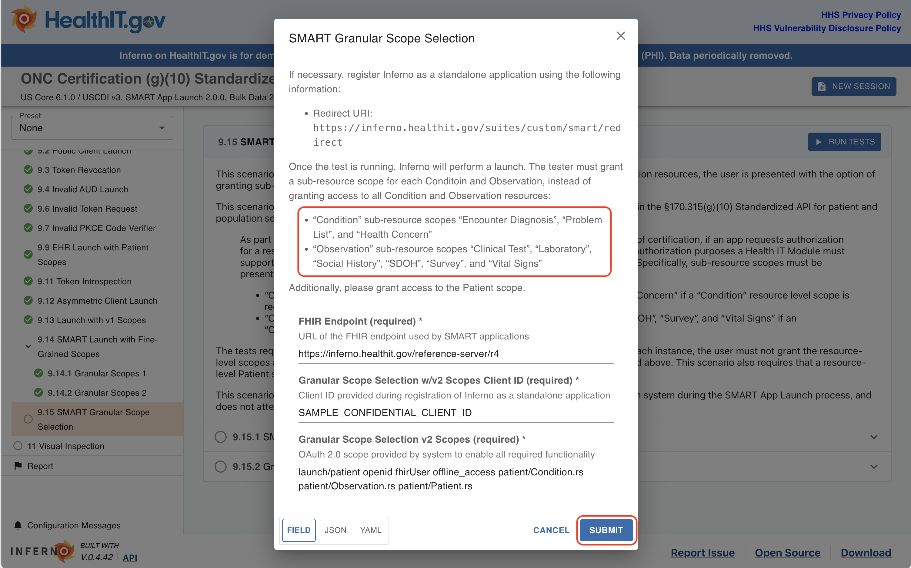

  * Click 'SUBMIT'.
  * The tests start executing until user input is required. A 'User Action
    Required' modal will appear to ask if Inferno can redirect to the FHIR
    server's authorization page. Click 'Follow this link to authorize with the
    SMART server'.
  * Then you should follow the FHIR server's authorization process.
    For the Inferno reference server:
      * Select a Patient. For this example, select patient 85.

      

      * Uncheck the Condition and Observation resource-level scopes and instead
        select all of the sub-resource scopes for Condition and Observation
        that now are available to select.

      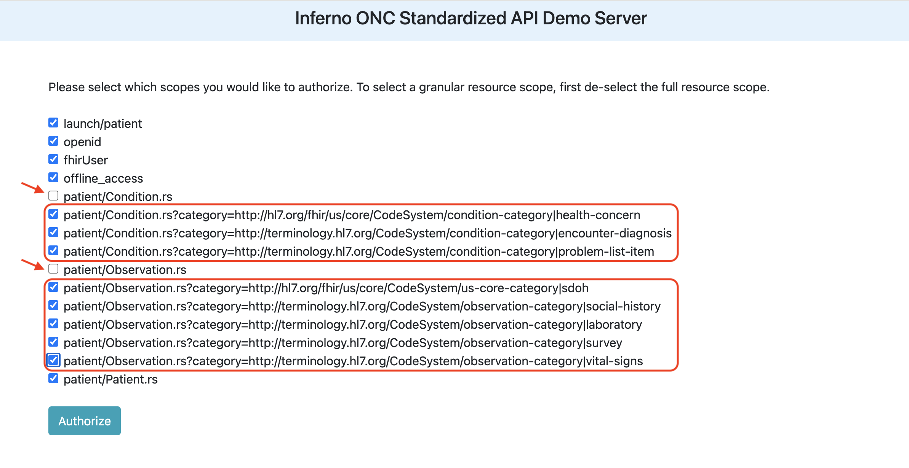
    
      * After you click 'Authorize' you will be redirected to the Inferno page, where the test will
        complete.

* **Visual Inspection And Attestation**. The purpose of this test is to verify
  conformance to portions of the test procedure that are not automated.
  * Click 'RUN TESTS'.
  * The 'Visual Inspection and Attestation modal will appear, with a list of
    Yes/No radio buttons and text boxes for Notes. Click 'Yes' for each statement that is true, then click
    'SUBMIT'.

    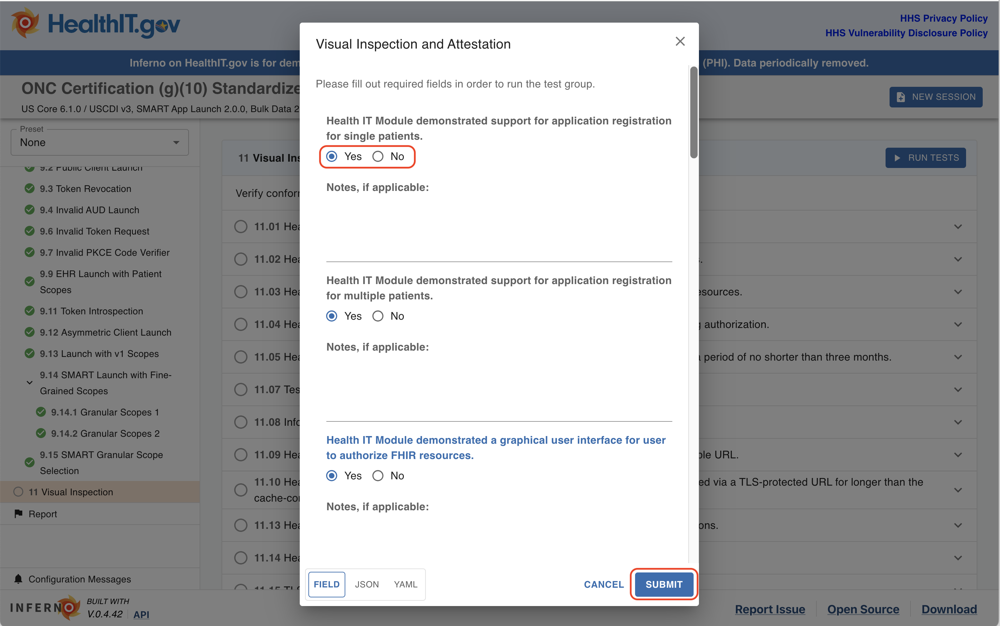

  * Note that systems are expected to reject requests from clients for TLS versions
    prior to 1.2.  Systems that accept connections for invalid versions of TLS, but
    do not send content over these connections, cannot be tested automatically.
    Systems that accept invalid versions of TLS will be presented with an extra
    section in the Visual Attestation modal that must be filled to document that
    the tester has verified that content does not get sent even though the connection
    could be established.  This is not necessary for the reference server because
    it rejects connections to TLS 1.2 outright.

    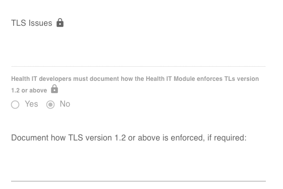

## Step 9: Review Results

All tests have now been completed.  To print out a copy of the results, click
on the 'Report' icon in the menu on the left and then the 'Print' icon that
is within that view.  Results on inferno.healthit.gov are not maintained
indefinitely, so please export this report if you would to keep a copy of the
results.

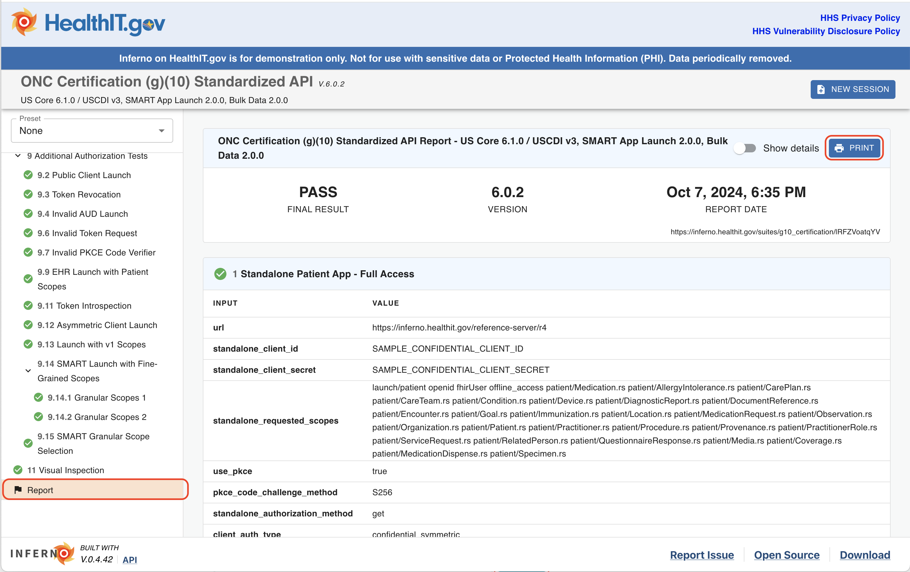
